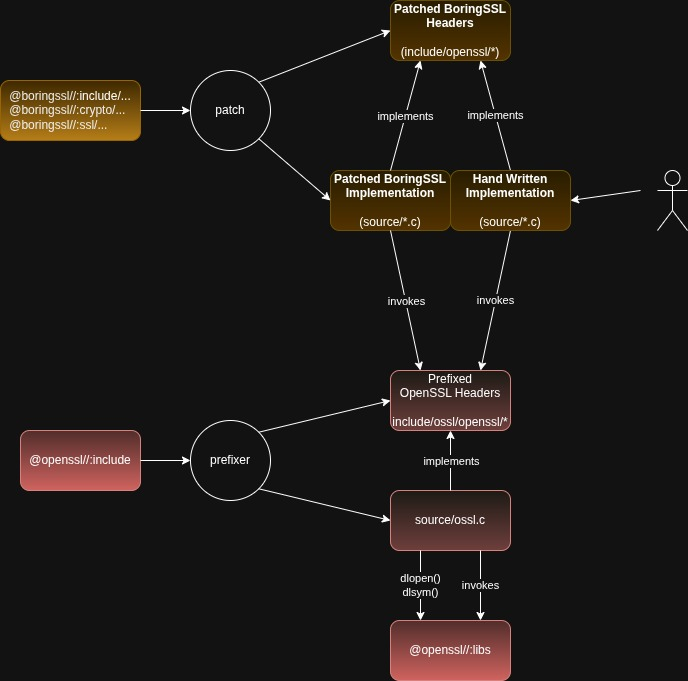

# Summary

Compatibility layer for BoringSSL to OpenSSL.

This builds on the work of the original Maistra bssl_wrapper code.

# Requirements
The following packages has to be installed if not yet available in your environment (host or container).

OpenSSL 3.0, development included:
```
sudo dnf install openssl-devel
```

Install clang and llvm:
```
sudo dnf install clang
```

Install  libclang-dev:
```
sudo dnf install clang-devel
```

Install llvm-devel:
```
sudo dnf install llvm-devel
```

Install perl:
```
sudo dnf install perl
```

# Building
Initialize and update git submodules by giving (from envoy-openssl/bssl-compat):

```
git submodule init
git submodule update
```
Build library and tests with:

```sh
mkdir build
cd build
cmake ..
cmake --build .
```

Then, if the OpenSSL libraries are not found in the host, you will have to adjust your LD_LIBRARY_PATH so that libcrypto.so & libssl.so are loaded from the 3.0.7 version of OpenSSL that was built:
```
export LD_LIBRARY_PATH=/usr/lib64/
```

And finally, the test can be performed:
```
ctest
```
If you want to force the re-build:
```
make clean && make
```

To launch LLVM lint tool clang-tidy, go to the build directory and launch:
```
.../bssl-compat/tools/do-clang-tidy.sh
```
At the end of build, compilation data base will be available in the file:
```
compile_commands.json
```
This make possible to run clang-tidy on a single files:
```
clang-tidy -p build/ <glob or files>
```

After clang-tidy has finished, before starting a build without clang-tidy, remove build directory and start from scratch for "normal" compilation.

To build and run with Address Sanitiser, go to the build directory and launch:
```
.../bssl-compat/tools/do-asan.sh 
ctest
```
Then, if errors are present, output will be available in the file:
```
envoy-openssl/bssl-compat/build/Testing/Temporary/LastTest.log
```

To build and run with Memory Sanitiser, go to the build directory and launch:
```
.../bssl-compat/tools/do-msan.sh 
```

To build and run with Thread Sanitiser, go to the build directory and launch:
```
.../bssl-compat/tools/do-tsan.sh 
ctest
```
Then, if errors are present, output will be available in the file:
```
envoy-openssl/bssl-compat/build/Testing/Temporary/LastTest.log
```


# Structure

The overall goal of the `bssl-compat` library is to provide an implementation of the BoringSSL API, sufficient enough that Envoy can be built against it. To provide that implementation, the `bssl-compat` library makes use of OpenSSL. Given this, it's clear that most code in the library will have to include headers from BoringSSL, to provide the API, and from OpenSSL, to provided the implementation. However, since the two sets of headers look extremely similar, they clash horribly when included in the same compilation unit. This leads to the `prefixer` tool, which gets built and run quite early in the build.

The `prefixer` tool copies the stock OpenSSL headers into `bssl-compat/include/ossl/openssl/*.h` and then adds the `ossl_` prefix to the name of every type, function, macro, effectively scoping the whole API. Prefixing the OpenSSL headers like this, enables us to write mapping code that includes headers from both BoringSSL and OpenSSL in the same compilation unit.

Since all of the OpenSSL identifiers are prefixed, the two sets of headers can coexist without clashing. However, such code will not link because it uses the prefixed symbols when making OpenSSL calls. To satisfy the prefixed symbols, the `prefixer` tool also generates the implementations of the prefixed functions into `bssl-compat/source/ossl.c`.

These generated functions simply make a forward call onto the real (non-prefixed) OpenSSL function, via a function pointer, which is set up by the generated `ossl_init()` library constructor function. This function is marked with the `__attribute__ ((constructor))` attribute, which ensures that it is called early, when the `bssl-compat` library is loaded. It uses `dlopen()` to load OpenSSL's `libcrypto.so` and `libssl.so`, and then uses `dlsym()` to lookup the address of each function and store it's address into the appropriate member of the generated `ossl_functions` struct.


